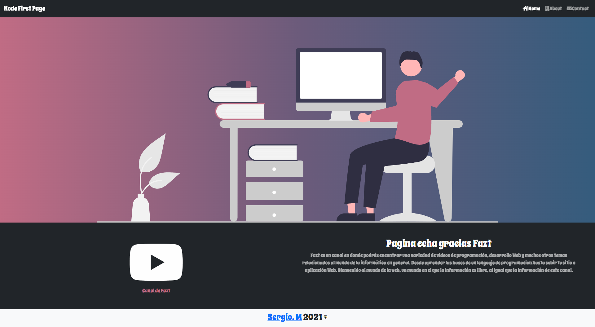
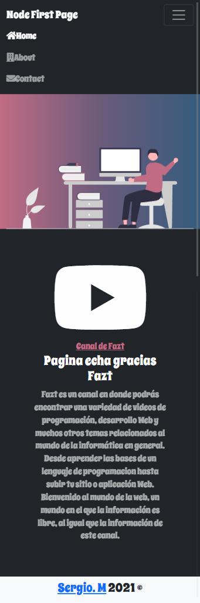

# Sobre que trata

Es sitio web completamente desde cero utilizando Nodejs, y Express. este ejemplo plantea la creación de un sitio con una navegación dinamica de manera similar como se haría con PHP.

# Captura de pantalla

